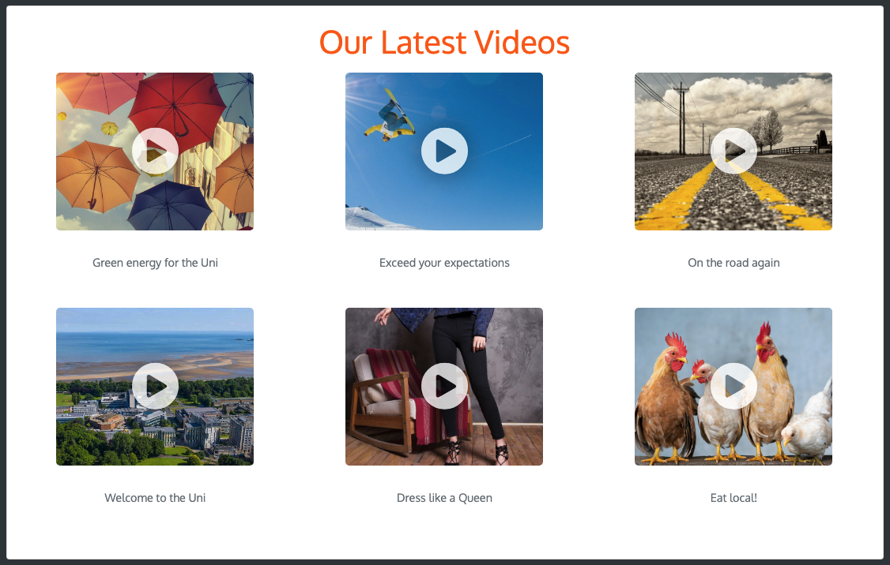

# media-galleries

##Jahia 8 module

Offer a video Gallery and Image Gallery components

## Installation

Download the code source on github, recompile the module locally, and deploy the module through your Jahia Modules administration panel

```bash
mvn clean install
```
###Video Gallery
you can add either internal or external (youtube,vimeo) videos
###Image Gallery
you can either add images manually or select a directory containing images.




